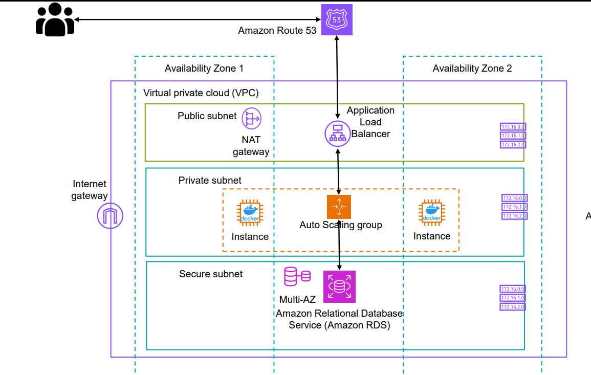

# infra_with_terraform

## Overview:

designed a cloud architecture using Terraform with three types of subnets: Public, Private, and Secure. Public subnets route traffic to the Internet Gateway, while Private subnets use a NAT Gateway for outbound internet access. Secure subnets have no routes to either the NAT Gateway or the Internet Gateway, enhancing security.
In the Public subnet, I created a Load Balancer across two Availability Zones (AZs), along with the necessary listeners and target groups.
For the Auto Scaling Group (ASG), I set it up in the Private subnet, spanning two AZs, and attached it to the Load Balancer. The desired, minimum, and maximum instance counts are all set to 1, ensuring that instances do not have public IPs. They connect via SSM or a Bastion host; I opted for SSM for easier management.
In the Secure subnet, I created a single-instance RDS to minimize costs, ensuring that only the application tier can access it.
Used VPC Flow Logs to capture application logs for monitoring and troubleshooting 

